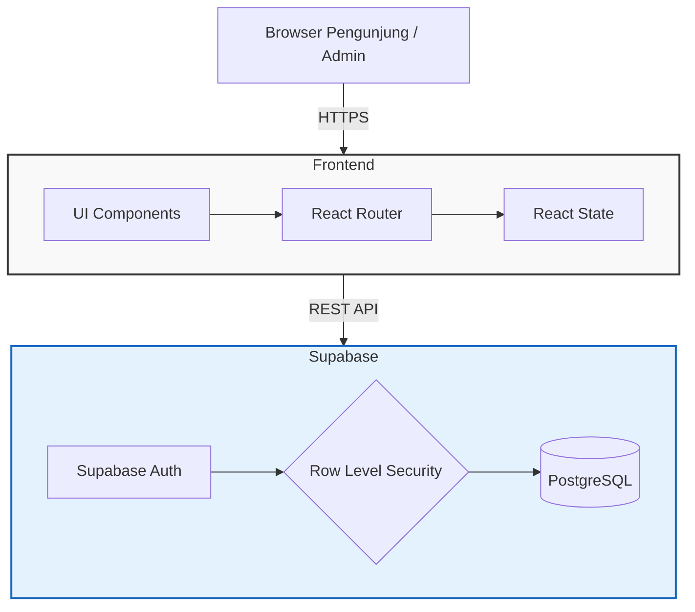

# Portify.id 🚀

Portify.id adalah *platform* modern berbasis web untuk layanan jasa pembuatan portofolio profesional dan *website* pribadi. Proyek ini dirancang sebagai *Single Page Application* (SPA) dengan antarmuka yang sangat interaktif dan terhubung dengan *Backend-as-a-Service* (BaaS) Supabase untuk manajemen pesanan dan komentar secara *real-time*.

## 🏗️ Arsitektur Sistem

Proyek ini dibangun dengan memisahkan *Client-side Rendering* (Vite + React) yang melayani UI, dan *Supabase* yang menangani Database (PostgreSQL) serta Autentikasi secara *serverless*.



## ✨ Fitur Utama

1. **Premium Landing Page**: UI modern dengan warna khusus (*True Pink*) dan animasi mikro menggunakan `framer-motion`.
2. **Sistem Pemesanan (Order Flow)**: Form terintegrasi untuk calon klien memesan paket *website*. Data pemesanan langsung tersimpan di *database* dengan aman.
3. **Sistem Testimoni Interaktif**: Pengunjung dapat meninggalkan komentar secara *real-time*.
4. **Admin Dashboard Berpelindung**: Portal admin (`/admin`) yang dilindungi otentikasi (Supabase Auth) untuk mengelola status pesanan dan memoderasi (menyetujui/menghapus) komentar.

## 🛠️ Tech Stack

- **Frontend Framework**: [React 18](https://reactjs.org/) + [Vite](https://vitejs.dev/)
- **Styling**: [Tailwind CSS](https://tailwindcss.com/)
- **Animation**: [Framer Motion](https://www.framer.com/motion/)
- **Routing**: [React Router v6](https://reactrouter.com/)
- **Backend & Database**: [Supabase](https://supabase.com/) (PostgreSQL + Auth)
- **Deployment**: Dioptimalkan untuk [Vercel](https://vercel.com/) (termasuk `vercel.json` untuk *rewrite* rute SPA).

## 📂 Struktur Folder

```text
portify.id/
├── public/                # Aset statis (Logo, Icon)
├── src/
│   ├── components/        # Komponen UI Reusable (Navbar, Hero, Pricing, dll)
│   ├── lib/               # Konfigurasi eksternal (supabase.js)
│   ├── pages/             # Halaman utama (Index, OrderPage, Admin)
│   ├── App.jsx            # Setup Router
│   └── main.jsx           # Entry point React
├── .env.example           # Template untuk variabel lingkungan
├── vercel.json            # Konfigurasi rewrite rute untuk Vercel
├── tailwind.config.js     # Konfigurasi tema dan warna kustom
└── vite.config.js         # Konfigurasi bundler Vite
```

## 🚀 Cara Menjalankan Secara Lokal

### 1. Instalasi
Pastikan Anda sudah menginstal Node.js. Clone repositori ini, lalu jalankan:
```bash
npm install
```

### 2. Setup Environment Variables
Buat file bernama `.env` di direktori utama (*root*) dan masukkan kredensial Supabase Anda:
```env
VITE_SUPABASE_URL="https://YOUR_PROJECT_ID.supabase.co"
VITE_SUPABASE_ANON_KEY="YOUR_ANON_KEY"
```

### 3. Setup Database (Supabase)
Jalankan skrip SQL berikut di **SQL Editor** pada dashboard Supabase Anda untuk membuat tabel dan mengatur kebijakan keamanan (*Row Level Security*):

<details>
<summary>Klik untuk melihat Skrip SQL</summary>

```sql
-- TABEL ORDERS
CREATE TABLE IF NOT EXISTS orders (
  id SERIAL PRIMARY KEY,
  name TEXT NOT NULL,
  phone TEXT NOT NULL,
  email TEXT NOT NULL,
  package TEXT NOT NULL,
  details TEXT,
  status TEXT DEFAULT 'pending',
  created_at TIMESTAMP WITH TIME ZONE DEFAULT CURRENT_TIMESTAMP
);

ALTER TABLE orders ENABLE ROW LEVEL SECURITY;
CREATE POLICY "Allow public insert access" ON orders FOR INSERT WITH CHECK (true);
CREATE POLICY "Allow admin read orders" ON orders FOR SELECT TO authenticated USING (true);
CREATE POLICY "Allow admin update orders" ON orders FOR UPDATE TO authenticated USING (true);

-- TABEL COMMENTS
CREATE TABLE IF NOT EXISTS comments (
  id SERIAL PRIMARY KEY,
  name TEXT NOT NULL,
  content TEXT NOT NULL,
  created_at TIMESTAMP WITH TIME ZONE DEFAULT CURRENT_TIMESTAMP,
  is_approved BOOLEAN DEFAULT true
);

ALTER TABLE comments ENABLE ROW LEVEL SECURITY;
CREATE POLICY "Allow public read access" ON comments FOR SELECT USING (true);
CREATE POLICY "Allow public insert access" ON comments FOR INSERT WITH CHECK (true);
CREATE POLICY "Allow admin delete comments" ON comments FOR DELETE TO authenticated USING (true);
CREATE POLICY "Allow admin update comments" ON comments FOR UPDATE TO authenticated USING (true);
```
</details>

### 4. Jalankan Development Server
```bash
npm run dev
```
Buka `http://localhost:5173` di browser Anda. Akses dashboard admin melalui `http://localhost:5173/admin`.

## 📄 Lisensi
Hak cipta dilindungi oleh Portify.id.
